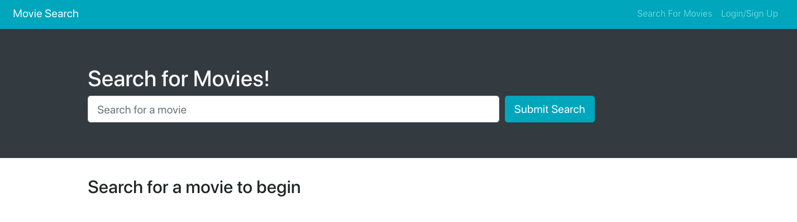
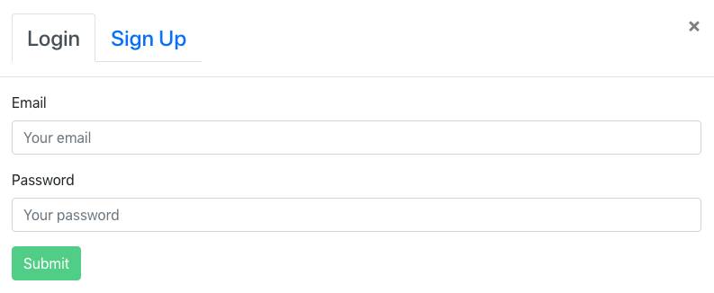
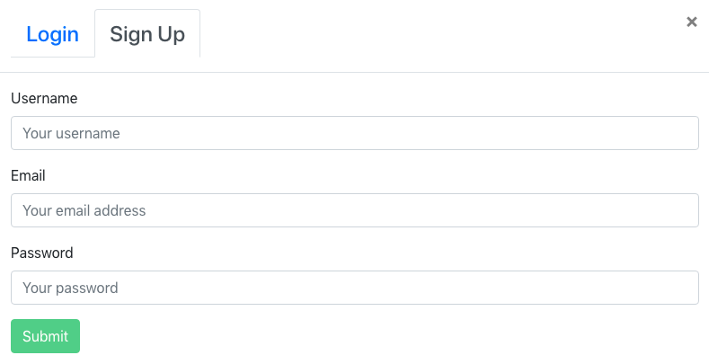
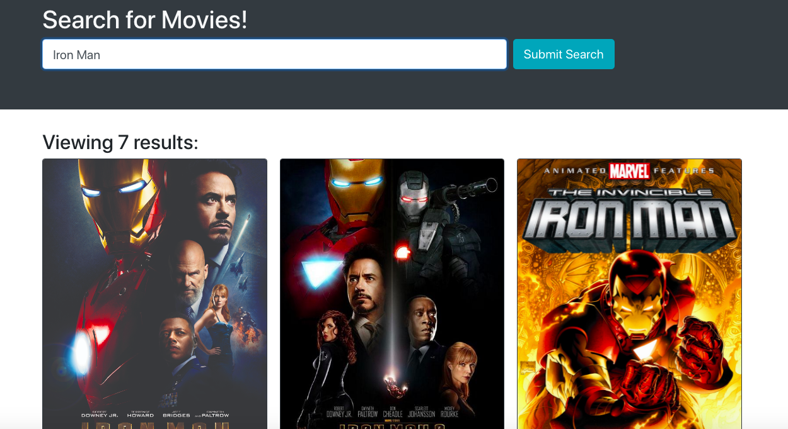
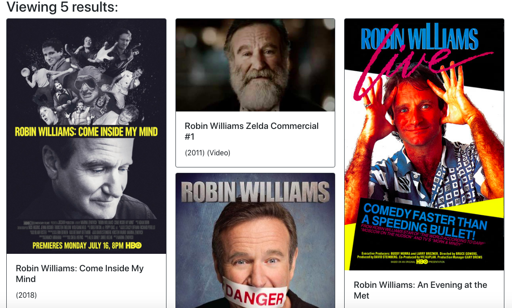
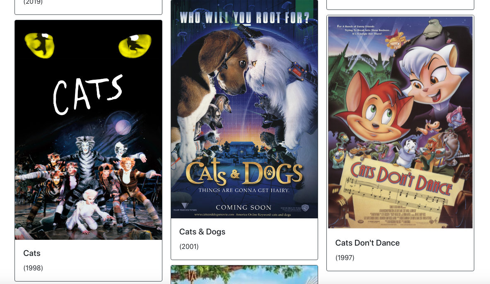

# MOVIE MADNESS

## Description
An app giving users a fast and easy way to search for and find movies allowing them to view the movie image, title, year it was made, ect. The user is able to search by movie title; whole title or just part the search will still find it. Can't remember the name of the movie? No problem! Find movies just by searching an actor's name!

## Heroku
Deployed App on [Heroku](https://pacific-ravine-22419.herokuapp.com/)

## Table of Contents

* [Usage](#usage)

* [Credits](#contributing)

* [Questions](#questions)
  

## Images

  

## Technologies

* JavaScript
* Node
* Express
* Mongoose
* React
* Jest
* Bootstrap
* IMDP API

## Deployment

Link to repo on [GitHub](https://github.com/Rachel-Reidenga/MERN-Movie-App)

### Contributing

[w3schools.com](https://www.w3schools.com/)

[stackoverflow](https://stackoverflow.com/)

Shout out to Tanetta J, Monica H and Paul C

### Questions
If there are any questions please contact [Lionel](https://github.com/leot42) , [Emily](https://github.com/emmccormick) ,[Anthony](https://github.com/Anthonyz28) or [Rachel](https://github.com/Rachel-Reidenga)